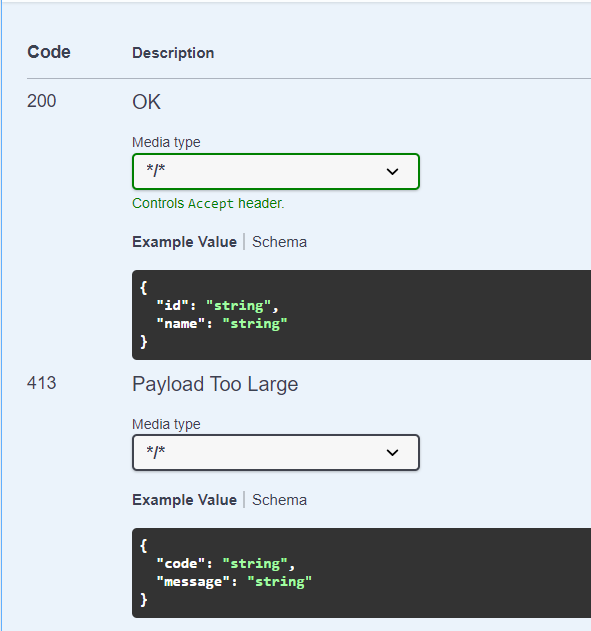
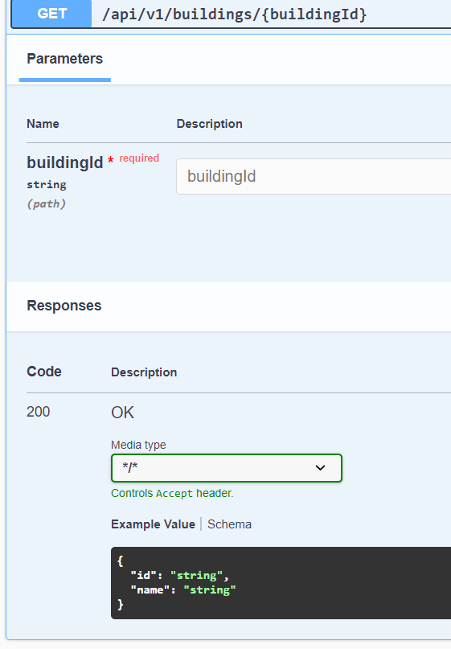

# Error Handling Spring Boot OpenApi

This repository demonstrate an "missing capability" to allow [springdoc-openapi](https://springdoc.org/) to pick up `@ResponseStatus` which is used to automatically documented in OpenApi specification.

## Setup w/o error-handling library

This setup exposes one `@GetMapping` in `ProfileController` and `BuildingController` respectively where one of it throws a `MyBusinessException` and is handled in `MyExceptionHandler`.

With what is documented in [springdoc-openapi](https://springdoc.org/#error-handling-for-rest-using-controlleradvice) for `@ControllerAdvice` (MyExceptionHandler.class), as long as the both `@ExceptionHandler` and `@ResponseStatus` is present, it will be picked up and generated accordingly.

This is generated for both `ProfileController` and `BuildingController` Api documentation. We could prevent it from generated for specific controller by "filtering" the `@ControllerAdvice` to a particular class, packages, etc. For example, `@ControllerAdvice(basePackages = "com.bwgjoseph.error_handling_spring_boot_openapi.profile")`

