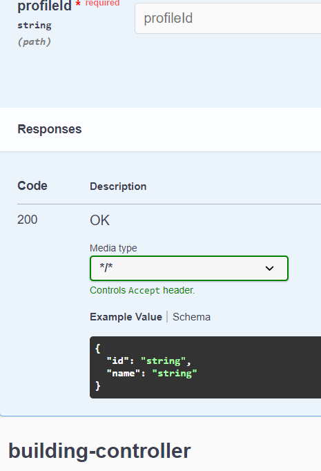

# Error Handling Spring Boot OpenApi

This repository demonstrate an "missing capability/integration" to allow [springdoc-openapi](https://springdoc.org/) to pick up `@ResponseStatus` which is used to automatically documented in OpenApi specification.

## Setup w/o error-handling library

This setup exposes one `@GetMapping` in `ProfileController` and `BuildingController` respectively where one of it throws a `MyBusinessException` and is handled in `MyExceptionHandler`.

With what is documented in [springdoc-openapi](https://springdoc.org/#error-handling-for-rest-using-controlleradvice) for `@ControllerAdvice` (MyExceptionHandler.class), as long as the both `@ExceptionHandler` and `@ResponseStatus` is present, it will be picked up and generated accordingly.


This is generated for both `ProfileController` and `BuildingController` Api documentation. We could prevent it from generated for specific controller by "filtering" the `@ControllerAdvice` to a particular class, packages, etc. For example, `@ControllerAdvice(basePackages = "com.bwgjoseph.error_handling_spring_boot_openapi.profile")`


## Setup using error-handling library

For those that are not aware, there's a very useful library - [error-handling-spring-boot-starter](https://github.com/wimdeblauwe/error-handling-spring-boot-starter) that provides proper and consistent error responses for REST APIs build with Spring Boot.

So rather than declaring the `@ControllerAdvice`, the library does it for us. With custom exception, one could declare the [@ResponseStatus](https://wimdeblauwe.github.io/error-handling-spring-boot-starter/current/#set-http-response-status-via-responsestatus) directly on the exception class.

```java
@ResponseStatus(HttpStatus.PAYLOAD_TOO_LARGE)
public class MyBusinessException extends RuntimeException {
    public MyBusinessException(String message) {
        super(message);
    }
}
```

This library has made my life so much easier, until I recently found out that it does not work well with `springdoc-openapi` as it does not pick up the error (exception) corectly, thus, causing the documentation to not be generated.

After adding [error-handling-spring-boot-starter](https://github.com/wimdeblauwe/error-handling-spring-boot-starter), I removed `@ControllerAdvice` annotation from `MyExceptionHandler` class to prevent it from being picked up.

Once added the library, I ran curl to ensure the library does what it supposed to do.

```bash
curl localhost:8080/api/v1/profiles/2
```

And the response is

```bash
{"code":"MY_BUSINESS","message":"profile"}
```

> Note: I also added `@ResponseStatus` to `MyBusinessException` class

Unfortunately, the library does what it supposed to, it removed the ability to allow the documentation to be generated properly.



It will be nice if `error-handling-spring-boot-starter` is able to support this "integration" with `springdoc-openapi`
